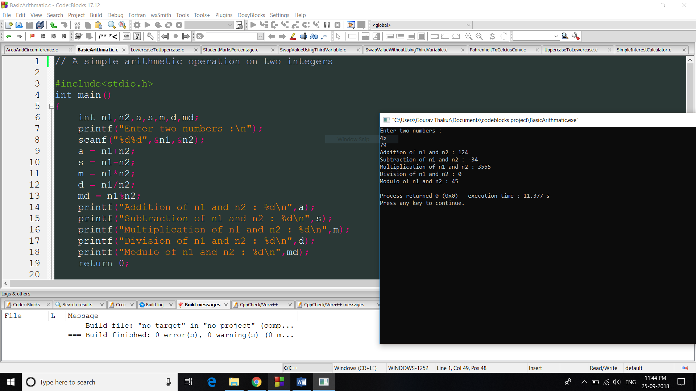

# Beginners C Program Examples

## :octocat: Fork and :eight_pointed_black_star: star this repo

Simple, short and sweet beginners friendly C language programs

“That's the thing about people who think they hate computers. What they really hate is lousy programmers.”
― Larry Niven

These program are written in codeblocks ide for windows. These programs are not very sophisticated as these are beginners friendly and have many bugs. Anyone who is new to c language can practice these examples.

- Only programs written in c language will be merged.
- Beautify/Format your code before making a PR. Poorly stuctured code with inconsistent spacing and bad variable name will not be merged.
- Use this tool to beautify your code : https://codebeautify.org/c-formatter-beautifier
- Make sure your program works after beautifying it.
- #include< stdio.h > is wrong and you must remove whitespaces. #include<stdio.h> is correct.
- Please check your spellings before making a PR
- Comment code properly.

# List of programs

- [Alphabet triangle](alphabetTriangle.cpp)
- [Area and circumference](AreaAndCircumference.c)
- [Armstrong Number](ArmstrongNumber.c)
- [Background Thread Sorter](BackgroundThreadSorter.c)
- [Basic Arithmatic](BasicArithmatic.c)
- [Basic Game](BasicGame.c)
- [Binary Search](BinarySearch.c)
- [Bitwise AND Operator](BitwiseAndOperator.c)
- [Bitwise Complement Operator](BitwiseComplementOperator.c)
- [Bitwise Left Shift Operator](BitwiseLeftshiftOperator.c)
- [Bitwise Odd or Even](BitwiseOddOrEven.c)
- [Bubble Sort](BubbleSort.c)
- [Caesar's Cipher](caesar_cipher.c)
- [Calculate Factorial upto input of 5000](large_factorial.c)
- [Calculate remainder](FindRemainder.c)
- [Calculator using switch case](CalcUsingSwitchCase.c)
- [Calculator](combine_calculator.c)
- [Celsius to Kelvin](CelciusToKelvinConv.c)
- [Check Character Type](CheckCharacterType.c)
- [Check leap year](isInputLeapYear.c)
- [Check odd or even](oddandeven.c)
- [Common elements in two array](CommonElementsInTwoArrays.c)
- [Daily Wage Calc](DailyWageCalc.c)
- [Day Name Using Switch Case](DayNameUsingSwitchCase.c)
- [Decimal To Binary](DecimalToBinary.c)
- [Decimal to base n conversion](DecimalToBaseN.c)
- [Decrement Operator](DecrementOperator.c)
- [Dice roll with Adjustable sides](DiceRoll.c)
- [Digital Root of a Number](DigitalRoot.c)
- [Display Linux Environment Variables](DisplayLinuxEnvirmentVariables.c)
- [Dyanamic 2D Array using Array of Pointer](DynamicTwoDArrayUsingArrayOfPointer.c)
- [Dynamic 2D Array Using One Pointer](DynamicTwoDArrayUsingOnePointer.c)
- [Employee Grade](EmployeeGrade.c)
- [Encrypt and Decrypt XOR](EncryptDecryptXOR.c)
- [Factorial of a number with recursion](RecursiveFactorial.c)
- [Factorial](Factorial.c)
- [Fahrenheit To Celcius](FahrenheitToCelciusConv.c)
- [Fibonnaci Generation](FibonacciGeneration.c)
- [Find ASCII Value](FindAsciiValue.c)
- [Find largest number](Largest.c)
- [Get String Length](StringLength.c)
- [Goto statement](GotoStatementEvenOrOdd.c)
- [Haystack and Needle (SubString)](HaystackAndNeedle_SubString.c)
- [Hello World!](HelloWorld.c)
- [Identify machine is big-endian or little-endian](endian.c)
- [Increment Operator](IncrementOperator.c)
- [Insertion Sort](Insertionsort.c)
- [Leap Year Using Ternary Operator](LeapYearTernaryOperator.c)
- [Lowercase To Uppercase](LowercaseToUppercase.c)
- [Merge Sort](Mergesort.c)
- [Mirror Number](MirrorNumber.c)
- [Nested If Leap Year](NestedIfLeapYear.c)
- [Nested if Greatest Integer](NestedifGreatestInteger.c)
- [Palindrome Number](https://github.com/geetanjaliaich/beginners-C-program-examples/blob/FactorialEratosthenes/PalindromeNumber.c)
- [Perform Selection Sort](SelectionSort.c)
- [Pointers in C](Pointers.c)
- [Polynomial linklist](Polynomial_linklist.c)
- [Print 100 Prime numbers using Seive of Eratosthenes](https://github.com/geetanjaliaich/beginners-C-program-examples/blob/FactorialEratosthenes/PrimeByEratosthenes.c)
- [Print pattern](Pattern1.c)
- [Print prime numbers](Prime.c)
- [Quick Sort](Quicksort.c)
- [Recursion](Recursion.c)
- [Relational Operators in C](RelationalOperators.c)
- [Reverse Number 2](ReverseNumber2.c)
- [Reverse Number](ReverseNumber.c)
- [Segmentation Fault or Bus Error Demo](SegmentationFaultorBusErrorDemo.c)
- [Simple EMI Calculator](SimpleEMICalculator.c)
- [Simple Interest Calculator](SimpleInterestCalculator.c)
- [Simple multiplication table](SimpleMultiplicationTable.c)
- [Sizeof Operator](SizeofOperator.c)
- [Square root](SquareRoot.c)
- [Stack implemenation of linklist](Stack%20-%20Linked%20List.c)
- [Structure](Structure.c)
- [Student Marks Percentage](StudentMarksPercentage.c)
- [Swap By Reference Vs Swap By Copy](SwapByRefandCopy.c)
- [Swap Value Without Using Third Variable](SwapValueWithoutUsingThirdVariable.c)
- [Swap Values Using Third Variable](SwapValueUsingThirdVariable.c)
- [Swap integers without 3rd variable](SwapIntegers.c)
- [Swap value without third variable](SwapValueWithoutUsingThirdVariable.c)
- [Swapping 2 Numbers Without a Third Variable or ^](<https://github.com/geetanjaliaich/beginners-C-program-examples/blob/FactorialEratosthenes/SwapIntegersWithout3rdVariable(Arithmatic).c>)
- [Temperature conversion](AllTempScalesConv.c)
- [Ternary Operator](TernaryOperator.c)
- [To calculate the Least Common Multiple](lcm.c)
- [To check if a matrix is a sparse matrix or not](SparseMatrix_017.c)
- [Two-way decimal to hexadecimal](DecimalToHexadecimalViceVersa.c)
- [Uppercase To Lowercase](UppercaseToLowercase.c)
- [Vowel or Consonant](VowelorConsonant.c)

# Contributing

This is a personal learning project for me.

Please feel free to fork this repo. Pull request to submit more programs.
